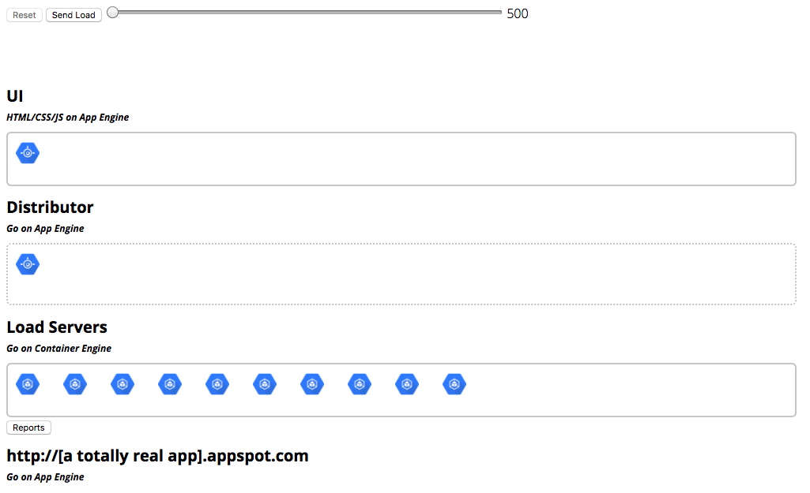
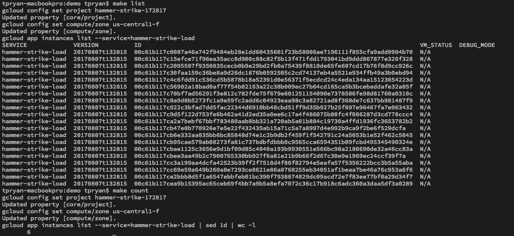
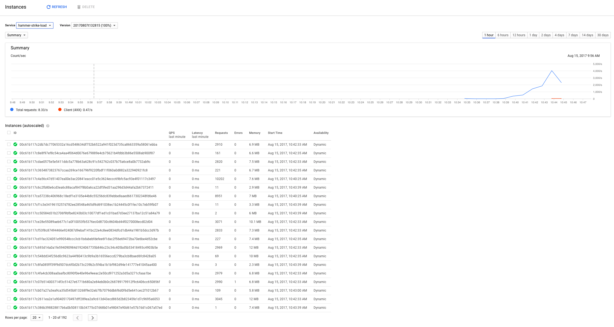

# Running this demo publically
This app was meant to be a demo of how App Engine scales.  It can be used to 
show just how fast App Engine can spin up a lot of instances.  

## How to demo
1. Explain the architecture of the application 
    1. We're looking at UI layer
    1. UI layer talks to the distributor
    1. Distributor divides the number of requests evenly among load generating 
    machines. 
    1. Load machines hit load bearing App Engine app and records traffic in 
    memcache. 
1. Demonstrate that there are no instances of App Engine app running
    1. Command line 
        1. `cd demo`
        1. `make list`
        1. If there are any run `make clean` to remove all
    1. Web Interface 
        1. [Cloud Console - App Engine Instances](console.cloud.google.com/appengine/instances?serviceId=hammer-strike-load)
1. Send load
1. Demonstrate that instances were really created.
    1. Command line
        1. `cd demo`
        1. `make count`
        1. `make list`
    1. Web Interface
        1. [Cloud Console - App Engine Instances](console.cloud.google.com/appengine/instances?serviceId=hammer-strike-load)
    * Note that interogating this services can take awhile, and when you do, a 
    signficant number of instances might already be gone. 
1. Ramp up number of requests to send. 
1. Raise and Repeat

## Expectations
* Cold QPS scores: 75 - 150. 
* Regular warmed QPS scores: 700-1200.
* QPS will go up as number of requests goes up. 
* Upper bounds for QPS 4,000 -6,000   

## Questions
<dl>
    <dt>What impacts QPS (Queries per second)</dt>
    <dd>Well obviously the app itself does. But I have gotten a version of 
    the app above 8500 QPS. I think the limit is impacted by the load generating
    boxes and their throughput. Beefier machines here might help.  </dd>
    <dt>Why does the URL change from "a totally real url" to totally real 
    url?</dt>
    <dd>A real URL invited clicks. Before the demo runs, these clicks break the 
    demo - they prewarm App Engine, which will inflate our results - not 
    cool. But after the demo runs, if they want to kick the tires, that's 
    fine. Keep in mind if the audience clicks the link, it will drive 
    down reported QPS time. Because they are adding new requests way after 
    initial request.</dd>
</dl>    